# Indian Bovine Breed Classification Using Transfer Learning

> A deep learning pipeline for the automated classification of 41 Indian bovine breeds from photographic imagery, employing EfficientNet-B0 transfer learning with extensive data augmentation and ONNX-based deployment support.

---

## Table of Contents

1. [Abstract](#abstract)
2. [Dataset Description](#dataset-description)
   - [Source Data](#source-data)
   - [Class Distribution](#class-distribution)
   - [Data Augmentation Strategy](#data-augmentation-strategy)
3. [Methodology](#methodology)
   - [Architecture Selection](#architecture-selection)
   - [Transfer Learning Protocol](#transfer-learning-protocol)
   - [Regularisation Techniques](#regularisation-techniques)
   - [Training Configuration](#training-configuration)
4. [Pipeline Architecture](#pipeline-architecture)
   - [Training Pipeline](#training-pipeline)
   - [Inference Pipeline](#inference-pipeline)
   - [Model Inspection Utility](#model-inspection-utility)
5. [Implementation Details](#implementation-details)
   - [Data Loading and Preprocessing](#data-loading-and-preprocessing)
   - [Phase 1: Frozen Backbone Training](#phase-1-frozen-backbone-training)
   - [Phase 2: Full Fine-Tuning](#phase-2-full-fine-tuning)
   - [Phase 3: Hard-Negative Mining](#phase-3-hard-negative-mining)
   - [Checkpoint Management](#checkpoint-management)
   - [ONNX Export and Validation](#onnx-export-and-validation)
   - [TorchScript Export](#torchscript-export)
6. [Object Detection Integration](#object-detection-integration)
7. [Test-Time Augmentation](#test-time-augmentation)
8. [Evaluation Results](#evaluation-results)
   - [Overall Performance](#overall-performance)
   - [Per-Class Accuracy](#per-class-accuracy)
   - [Hard-Negative Pairs](#hard-negative-pairs)
9. [Streamlit Demo App](#streamlit-demo-app)
10. [Evaluation Metrics](#evaluation-metrics)
11. [Repository Structure](#repository-structure)
12. [Environment Setup](#environment-setup)
13. [Usage](#usage)
    - [Training](#training)
    - [Hard-Negative Only Training](#hard-negative-only-training)
    - [Resuming Training](#resuming-training)
    - [Inference](#inference)
    - [Model Inspection](#model-inspection)
    - [Batch Evaluation](#batch-evaluation)
    - [Streamlit App](#streamlit-app)
14. [Technical Specifications](#technical-specifications)
15. [License](#license)
16. [Acknowledgements](#acknowledgements)

---

## Abstract

This repository presents an end-to-end deep learning system for the fine-grained visual classification of 41 bovine breeds native to or commonly found in India. The system is developed as part of the EYIC (Engineering Youth for India Competition) initiative. It leverages the EfficientNet-B0 convolutional neural network architecture, pre-trained on ImageNet, and fine-tuned on a curated dataset of 5,948 labelled bovine images. To combat class imbalance and limited per-class sample sizes, the pipeline incorporates a comprehensive offline data augmentation strategy that expands the training set by a factor of 11 (original plus 10 augmented copies per image), with additional copies for hard-negative breeds. The pipeline includes a dedicated hard-negative mining phase to reduce confusion between visually similar breeds. The trained model is exported to both ONNX and TorchScript (PyTorch Lite) formats for cross-platform deployment. A Streamlit web demo with test-time augmentation (TTA) is included for interactive inference.

**Current model performance: 88.59% accuracy on the full dataset (5251/5927 correct).**


---

## Dataset Description

### Source Data

The dataset comprises **5,948 images** distributed across **41 bovine breed classes**, sourced and organised under the `dataset/Indian_bovine_breeds/` directory. Each breed occupies its own subdirectory, and a CSV metadata file (`bovine_breeds_metadata.csv`) provides image-level annotations including the image identifier, breed label, and relative file path.

The dataset includes both indigenous Indian breeds (e.g., Gir, Sahiwal, Kangayam, Ongole) and internationally established breeds found in Indian dairy operations (e.g., Holstein Friesian, Jersey, Brown Swiss, Ayrshire).

### Class Distribution

The dataset exhibits significant class imbalance, a common challenge in fine-grained recognition tasks. The per-class sample counts are as follows:

| Breed | Samples | | Breed | Samples |
|---|---:|---|---|---:|
| Sahiwal | 439 | | Kangayam | 91 |
| Gir | 372 | | Nili Ravi | 89 |
| Holstein Friesian | 328 | | Nagori | 89 |
| Ayrshire | 234 | | Bhadawari | 86 |
| Brown Swiss | 225 | | Nimari | 84 |
| Tharparkar | 217 | | Dangi | 82 |
| Jersey | 203 | | Umblachery | 76 |
| Ongole | 191 | | Surti | 64 |
| Nagpuri | 187 | | Kenkatha | 55 |
| Hallikar | 186 | | Kherigarh | 36 |
| Kankrej | 179 | | Alambadi | 99 |
| Murrah | 173 | | Amritmahal | 94 |
| Red Dane | 167 | | Bargur | 94 |
| Red Sindhi | 166 | | Kasargod | 95 |
| Rathi | 149 | | Mehsana | 95 |
| Vechur | 140 | | Deoni | 99 |
| Krishna Valley | 136 | | Banni | 109 |
| Hariana | 129 | | Malnad Gidda | 107 |
| Pulikulam | 125 | | Jaffrabadi | 102 |
| Toda | 124 | | Khillari | 113 |
| Guernsey | 119 | | | |

The imbalance ratio between the most represented class (Sahiwal, 439 images) and the least represented class (Kherigarh, 36 images) is approximately 12:1. This imbalance is addressed through stratified splitting and augmentation strategies described below.

### Data Augmentation Strategy

To mitigate overfitting and class imbalance, an offline augmentation pipeline generates **10 augmented copies per training image**, stored persistently in the `dataset/augmented/` directory. The augmentation pipeline employs the [Albumentations](https://albumentations.ai/) library with the following stochastic transformations:

| Transformation | Parameters | Probability |
|---|---|---:|
| RandomResizedCrop | scale (0.6, 1.0), ratio (0.75, 1.33), output 224x224 | 1.0 |
| HorizontalFlip | -- | 0.5 |
| VerticalFlip | -- | 0.1 |
| Rotation | limit +/-30 degrees | 0.5 |
| ShiftScaleRotate | shift 0.1, scale 0.2, rotate +/-25 degrees | 0.5 |
| ColorJitter | brightness 0.3, contrast 0.3, saturation 0.3, hue 0.1 | 0.6 |
| RandomBrightnessContrast | brightness 0.2, contrast 0.2 | 0.5 |
| GaussNoise | -- | 0.3 |
| GaussianBlur | kernel (3, 5) | 0.2 |
| CoarseDropout | 1--8 holes, 8--20 px each | 0.3 |
| Affine | scale (0.8, 1.2), translate +/-10%, rotate +/-15 degrees | 0.4 |

This composition is applied independently to each copy, ensuring substantial variation across augmented samples. Breeds identified as hard-negative pairs (frequently confused with each other) receive **15 augmented copies** instead of 10 to improve discrimination. The augmented dataset totals approximately **55,000+ images** and is persisted to disk with its own metadata CSV to avoid redundant regeneration across training runs.

---

## Methodology

### Architecture Selection

The classifier employs **EfficientNet-B0** as the backbone feature extractor, instantiated via the [timm](https://github.com/huggingface/pytorch-image-models) (PyTorch Image Models) library. EfficientNet-B0 was selected for the following reasons:

1. **Parameter efficiency**: With approximately 5.3 million parameters, EfficientNet-B0 achieves a favourable accuracy-to-computation ratio, making it suitable for deployment on resource-constrained hardware.
2. **Compound scaling**: The EfficientNet family employs compound coefficient scaling across depth, width, and resolution, yielding architectures that are empirically more efficient than their manually designed counterparts (e.g., ResNet, VGG).
3. **Pre-trained representations**: ImageNet-pre-trained weights provide a strong initialisation for the convolutional feature hierarchy, enabling effective transfer to the bovine breed domain with limited labelled data.

The classification head consists of a single fully connected layer mapping the 1,280-dimensional feature embedding to 41 output logits, with a dropout rate of 0.4 applied prior to the final projection.

### Transfer Learning Protocol

Training follows a **three-phase transfer learning** strategy:

**Phase 1 -- Frozen Backbone (5 epochs):**
All parameters in the convolutional backbone are frozen, and only the classification head is trained. This allows the randomly initialised head to converge to a reasonable operating point without disrupting the pre-trained feature representations. A relatively high learning rate of 3e-3 is used with cosine annealing.

**Phase 2 -- Full Fine-Tuning (up to 30 epochs):**
All parameters are unfrozen and trained end-to-end. A discriminative learning rate scheme is applied:
- Backbone parameters: 1e-5 (FINETUNE_LR x 0.1)
- Classification head parameters: 1e-4

This differential rate ensures that pre-trained backbone weights are updated conservatively while the head adapts more aggressively. The scheduler employs cosine annealing with warm restarts (T_0 = 10, T_mult = 2) to facilitate escape from local minima.

**Phase 3 -- Hard-Negative Mining (up to 10 epochs):**
The best checkpoint from Phase 2 is loaded and fine-tuned exclusively on hard-negative breed pairs (breeds that are frequently confused with each other). The dataset is balanced via oversampling so minority breeds in each pair are adequately represented. A very low learning rate of 5e-5 is used to avoid degrading general performance, and validation is performed on the full validation set. Early stopping with patience 5 prevents overfitting.

### Regularisation Techniques

The pipeline incorporates multiple regularisation mechanisms to prevent overfitting on the relatively small per-class sample sizes:

| Technique | Implementation Details |
|---|---|
| **Label Smoothing** | Cross-entropy loss with smoothing factor epsilon = 0.1, distributing 10% of the probability mass uniformly across non-target classes. |
| **Dropout** | Applied at the classification head with rate p = 0.4. |
| **Mixup** | With probability 0.5 during fine-tuning, input images and labels are convexly combined using a Beta(0.3, 0.3) mixing coefficient. |
| **CutMix** | With probability 0.5 during fine-tuning (mutually exclusive with Mixup per batch), rectangular regions are cut and pasted between training samples using a Beta(1.0, 1.0) mixing coefficient. |
| **Gradient Clipping** | L2 norm clipping with max_norm = 1.0 to stabilise training dynamics. |
| **Weight Decay** | AdamW optimiser with weight decay coefficient lambda = 1e-2. |
| **Early Stopping** | Training halts if validation accuracy does not improve for 10 consecutive epochs. |
| **Offline Augmentation** | 10x augmented copies per training image (15x for hard-negative breeds). |
| **Hard-Negative Mining** | Phase 3 fine-tuning on 26 confused breed pairs with balanced oversampling, LR 5e-5, label smoothing 0.15. |

### Training Configuration

The complete set of training hyperparameters is summarised below:

| Parameter | Value |
|---|---:|
| Input resolution | 224 x 224 pixels |
| Batch size | 32 |
| Phase 1 epochs (frozen) | 5 |
| Phase 2 epochs (fine-tune) | 30 (max) |
| Phase 1 learning rate | 3e-3 |
| Phase 2 learning rate (head) | 1e-4 |
| Phase 2 learning rate (backbone) | 1e-5 |
| Optimiser | AdamW |
| Weight decay | 1e-2 |
| Label smoothing | 0.1 |
| Dropout rate | 0.4 |
| Mixup alpha | 0.3 |
| CutMix alpha | 1.0 |
| Mixup/CutMix probability | 0.5 |
| Gradient clip norm | 1.0 |
| Early stopping patience | 10 epochs |
| Validation split | 20% (stratified) |
| Random seed | 42 |
| Number of workers | 4 |
| Augmentation copies | 10 (15 for hard-neg breeds) |
| Hard-neg mining LR | 5e-5 |
| Hard-neg epochs | 10 (max) |
| Hard-neg patience | 5 epochs |
| Hard-neg label smoothing | 0.15 |

---

## Pipeline Architecture

### Training Pipeline

The training pipeline (`train_pipeline.py`) is organised as a sequential six-stage process:

```
[1/6] Load Metadata
  |-- Read bovine_breeds_metadata.csv
  |-- Validate file paths
  v
[2/6] Encode Labels and Split
  |-- LabelEncoder: breed names -> integer indices
  |-- Stratified train/val split (80/20)
  |-- Persist label map to breed_labels.json
  v
[3/6] Generate Augmented Dataset
  |-- 10x offline augmentation per training image
  |-- Persist to dataset/augmented/
  v
[4/6] Train EfficientNet-B0
  |-- Phase 1: Frozen backbone (5 epochs)
  |-- Phase 2: Full fine-tuning (up to 30 epochs)
  |-- Phase 3: Hard-negative mining (up to 10 epochs, optional)
  |-- Checkpoint best and last models
  v
[5/6] Model Diagnostics
  |-- Load best checkpoint
  |-- Compute validation metrics (accuracy, F1, precision, recall)
  |-- Per-class classification report
  v
[6/6] Export Models
  |-- Export best model to breed_classifier.onnx
  |-- Export best model to breed_classifier.ptl (TorchScript for Android)
  |-- Validate ONNX graph integrity
  |-- Verify numerical equivalence with PyTorch model
```

### Inference Pipeline

The inference subsystem combines **object detection** with **breed classification** in a two-stage cascade:

1. **Detection**: YOLOv8-nano (`yolov8n.pt`) detects bovine instances in the input image using COCO class ID 19 (cow) with a configurable confidence threshold (default 0.5). Detected animals are cropped from the image.
2. **Classification**: Each cropped region is resized, normalised, and passed through the trained EfficientNet-B0 classifier. Softmax probabilities are computed to yield a breed prediction and associated confidence score.

If no bovine instances are detected, the full image is passed directly to the classifier as a fallback.

### Model Inspection Utility

The `model_info.py` script provides comprehensive diagnostic reporting for both PyTorch and ONNX model artefacts:

- **PyTorch inspection**: Parameter counts (total, trainable, frozen), memory footprint, layer-by-layer breakdown, per-block parameter distribution, and forward pass validation.
- **ONNX inspection**: Graph validity, opset version, node and initialiser counts, operator breakdown, and ONNX Runtime inference verification.
- **Cross-format comparison**: File size comparison, CPU inference latency benchmarking (averaged over 100 runs), and numerical equivalence testing between PyTorch and ONNX outputs.

---

## Implementation Details

### Data Loading and Preprocessing

Two PyTorch `Dataset` implementations are provided:

- **`BreedDataset`**: Serves the original (non-augmented) images from the source dataset. Used for the validation set.
- **`AugmentedBreedDataset`**: Serves images from the pre-generated augmented dataset directory. Used for the training set.

Both datasets apply transform pipelines at load time:

**Training transform:**
- Resize to 224 x 224
- ImageNet normalisation (mean = [0.485, 0.456, 0.406], std = [0.229, 0.224, 0.225])

**Validation transform:**
- Resize to 256 x 256
- Centre crop to 224 x 224
- ImageNet normalisation

Images are loaded via OpenCV and converted from BGR to RGB colour space.

### Phase 1: Frozen Backbone Training

During Phase 1, all parameters except those belonging to the `classifier` module are frozen (i.e., `requires_grad = False`). Only the final fully connected layer is updated, using AdamW with a learning rate of 3e-3 and cosine annealing over 5 epochs. Mixup and CutMix are disabled during this phase to provide clean gradient signals for head initialisation.

### Phase 2: Full Fine-Tuning

All parameters are unfrozen and trained with discriminative learning rates. The AdamW optimiser uses two parameter groups:

```python
[
    {"params": backbone_params, "lr": 1e-5},   # conservative backbone updates
    {"params": head_params,     "lr": 1e-4},    # aggressive head updates
]
```

Cosine annealing with warm restarts (T_0 = 10, T_mult = 2) enables periodic learning rate resets. Mixup and CutMix augmentation is active during this phase, applied stochastically with per-batch probability 0.5.

### Phase 3: Hard-Negative Mining

After Phase 2 converges, an optional Phase 3 loads the best checkpoint and fine-tunes exclusively on hard-negative breed pairs -- breeds that the model frequently confuses. A `HardNegativeDataset` filters the augmented training data to only include breeds from the 26 identified confused pairs, then oversamples minority breeds to balance representation.

Key configuration:
- Learning rate: 5e-5 (very low to preserve general performance)
- Label smoothing: 0.15 (slightly higher than Phase 2)
- Validation: performed on the full validation set (not just hard-neg breeds)
- Early stopping: patience 5
- Mixup/CutMix: enabled

This phase can be run independently on an existing checkpoint without retraining from scratch using `--skip-training --hard-neg-only`.

### Checkpoint Management

The pipeline maintains two checkpoint files:

| File | Purpose |
|---|---|
| `best_breed_classifier.pth` | Best model by validation accuracy. Contains model state dict, optimiser state, scheduler state, epoch, validation accuracy, and class count. |
| `last_checkpoint.pth` | Most recent epoch checkpoint. Enables training resumption from an arbitrary interruption point. |

Both checkpoints store sufficient state (including patience counters and training phase indicators) to enable seamless mid-training resumption via the `--resume` flag.

### ONNX Export and Validation

The best-performing PyTorch model is exported to the ONNX interchange format using `torch.onnx.export` with the following configuration:

- ONNX opset version 18
- Constant folding enabled
- Dynamic batch size axis
- Named inputs (`input`) and outputs (`output`)

Post-export validation includes:
1. ONNX graph structural validation via `onnx.checker.check_model`
2. ONNX Runtime inference test with random input
3. Numerical equivalence verification against PyTorch outputs (max absolute difference threshold: 1e-5)

### TorchScript Export

The best model is also exported to **TorchScript (PyTorch Lite)** format (`breed_classifier.ptl`) for deployment on Android via PyTorch Mobile (`org.pytorch:pytorch_android`). The model is traced using `torch.jit.trace` and optimised for mobile using `torch.utils.mobile_optimizer.optimize_for_mobile`. This avoids any ONNX graph conversion and keeps the inference path identical to training. Numerical equivalence with the original PyTorch model is verified post-export.

---

## Object Detection Integration

The inference pipeline integrates **YOLOv8-nano** (from the [Ultralytics](https://github.com/ultralytics/ultralytics) framework) as a preprocessing stage for bovine localisation. This serves two purposes:

1. **Region of interest extraction**: Isolating individual animals from multi-subject or cluttered field photographs reduces background noise and improves classification accuracy.
2. **Multi-animal handling**: When multiple bovines are present in a single image, each is independently detected, cropped, and classified.

The detector targets COCO class 19 (cow) and applies a confidence threshold of 0.5 by default. Detection bounding boxes are used to crop PIL Image regions, which are then independently processed by the classification pipeline.

---

## Test-Time Augmentation

The Streamlit demo app and the inference pipeline support **test-time augmentation (TTA)**, which averages softmax probabilities over 8 augmented views of the input image:

| View | Description |
|---|---|
| Center crop | Standard Resize(256) + CenterCrop(224) |
| Horizontal flip | Center crop + horizontal flip |
| Top-left crop | 224x224 from top-left of 256x256 |
| Top-right crop | 224x224 from top-right of 256x256 |
| Bottom-left crop | 224x224 from bottom-left of 256x256 |
| Bottom-right crop | 224x224 from bottom-right of 256x256 |
| Brightness +10% | Center crop with brightness increase |
| Brightness -10% | Center crop with brightness decrease |

TTA improves accuracy on borderline predictions by reducing sensitivity to crop position and lighting conditions. It runs 8 forward passes instead of 1, so inference is ~8x slower but more robust.

---

## Evaluation Results

### Overall Performance

| Metric | Value |
|---|---:|
| Total images evaluated | 5,927 |
| Correctly classified | 5,251 |
| Misclassified | 676 |
| **Overall accuracy** | **88.59%** |

### Per-Class Accuracy

| Breed | Correct | Total | Accuracy | Top confusions |
|---|---:|---:|---:|---|
| Alambadi | 95 | 99 | 95.96% | Hallikar(2) |
| Amritmahal | 82 | 94 | 87.23% | Khillari(5), Hallikar(3) |
| Ayrshire | 220 | 234 | 94.02% | Holstein_Friesian(6) |
| Banni | 91 | 108 | 84.26% | Murrah(8) |
| Bargur | 89 | 93 | 95.70% | -- |
| Bhadawari | 66 | 86 | 76.74% | Toda(10) |
| Brown Swiss | 212 | 225 | 94.22% | -- |
| Dangi | 74 | 82 | 90.24% | -- |
| Deoni | 87 | 99 | 87.88% | Ongole(3) |
| Gir | 355 | 372 | 95.43% | Sahiwal(11) |
| Guernsey | 105 | 119 | 88.24% | Jersey(5) |
| Hallikar | 166 | 186 | 89.25% | Khillari(3), Ongole(3) |
| Hariana | 101 | 129 | 78.29% | Tharparkar(14) |
| Holstein Friesian | 312 | 328 | 95.12% | Jersey(6) |
| Jaffrabadi | 92 | 101 | 91.09% | -- |
| Jersey | 187 | 203 | 92.12% | Holstein_Friesian(7) |
| Kangayam | 81 | 91 | 89.01% | Pulikulam(3) |
| Kankrej | 170 | 178 | 95.51% | -- |
| Kasargod | 81 | 95 | 85.26% | Malnad_gidda(5) |
| Kenkatha | 40 | 55 | 72.73% | Hariana(3) |
| Kherigarh | 24 | 36 | 66.67% | Kenkatha(6) |
| Khillari | 96 | 113 | 84.96% | Hallikar(4) |
| Krishna Valley | 112 | 136 | 82.35% | Hallikar(3), Red_Dane(3) |
| Malnad Gidda | 93 | 107 | 86.92% | Kasargod(5) |
| Mehsana | 72 | 94 | 76.60% | Murrah(14) |
| Murrah | 154 | 173 | 89.02% | Nagpuri(6) |
| Nagori | 69 | 89 | 77.53% | Kenkatha(4) |
| Nagpuri | 139 | 182 | 76.37% | Murrah(9) |
| Nili Ravi | 75 | 88 | 85.23% | Murrah(7) |
| Nimari | 68 | 84 | 80.95% | Rathi(7) |
| Ongole | 175 | 191 | 91.62% | Tharparkar(6) |
| Pulikulam | 109 | 124 | 87.90% | Umblachery(4) |
| Rathi | 137 | 149 | 91.95% | Sahiwal(5) |
| Red Dane | 138 | 167 | 82.63% | Jersey(8) |
| Red Sindhi | 134 | 162 | 82.72% | Sahiwal(18) |
| Sahiwal | 410 | 439 | 93.39% | Red_Sindhi(11) |
| Surti | 46 | 59 | 77.97% | Mehsana(3) |
| Tharparkar | 201 | 217 | 92.63% | Krishna_Valley(4) |
| Toda | 106 | 124 | 85.48% | Bhadawari(11) |
| Umblachery | 68 | 76 | 89.47% | -- |
| Vechur | 119 | 140 | 85.00% | Sahiwal(5) |

### Hard-Negative Pairs

26 breed pairs are identified as frequently confused and receive special treatment during training (extra augmentation copies + dedicated Phase 3 fine-tuning):

Red_Sindhi-Sahiwal, Hariana-Tharparkar, Mehsana-Murrah, Gir-Sahiwal, Bhadawari-Toda, Murrah-Nagpuri, Banni-Murrah, Nimari-Rathi, Nili_Ravi-Murrah, Amritmahal-Khillari, Hallikar-Khillari, Jersey-Holstein_Friesian, Red_Dane-Jersey, Ayrshire-Holstein_Friesian, Kasargod-Malnad_gidda, Deoni-Ongole, Kenkatha-Kherigarh, Kenkatha-Hariana, Kangayam-Pulikulam, Pulikulam-Umblachery, Kasargod-Vechur, Malnad_gidda-Vechur, Gir-Red_Sindhi, Krishna_Valley-Hallikar, Nagori-Kenkatha, Surti-Mehsana.

---

## Streamlit Demo App

An interactive web demo (`app.py`) allows uploading images and classifying them using the ONNX model:

- Drag-and-drop or file upload interface
- Toggle for TTA (test-time augmentation, averaging 8 views)
- Top-5 predictions with confidence bars
- Runs locally via `streamlit run app.py`

---

## Evaluation Metrics

The pipeline computes the following metrics on the held-out validation set (20% of the original data, stratified by class):

| Metric | Description |
|---|---|
| **Accuracy** | Proportion of correctly classified samples. |
| **Macro F1-Score** | Unweighted mean of per-class F1 scores. Treats all classes equally regardless of support, making it sensitive to performance on rare breeds. |
| **Weighted F1-Score** | Support-weighted mean of per-class F1 scores. Reflects overall performance proportional to class frequency. |
| **Macro Precision** | Unweighted mean of per-class precision values. |
| **Macro Recall** | Unweighted mean of per-class recall values. |
| **Per-Class Report** | Full classification report including precision, recall, F1, and support for each of the 41 breed classes. |

These metrics are computed using scikit-learn's `classification_report`, `f1_score`, `precision_score`, and `recall_score` functions.

---

## Repository Structure

```
eyic-cattle-breed-classification/
|
|-- train_pipeline.py              # End-to-end training, evaluation, and export pipeline
|-- model_info.py                  # Model inspection, diagnostics, and graph generation
|-- app.py                         # Streamlit demo app with ONNX inference and TTA
|-- eval_all_breeds.py             # Batch evaluation across all breeds (ONNX)
|-- verify_onnx.py                 # PTH vs ONNX numerical equivalence verification
|-- breed_labels.json              # Integer-to-breed-name label mapping (41 classes)
|-- best_breed_classifier.pth      # Best model checkpoint (PyTorch, git-ignored)
|-- last_checkpoint.pth            # Latest epoch checkpoint (PyTorch, git-ignored)
|-- breed_classifier.onnx          # Exported ONNX model
|-- breed_classifier.ptl           # Exported TorchScript Lite model (Android)
|-- environment.yml                # Conda environment specification
|-- LICENSE                        # MIT License
|-- README.md                      # This document
|
|-- graphs/                        # Generated visualisation outputs
|   |-- dataset_distribution.png
|   |-- parameter_distribution.png
|   |-- layer_type_distribution.png
|   |-- confusion_matrix.png
|   |-- confusion_matrix_normalised.png
|   |-- per_class_f1.png
|   |-- per_class_precision_recall.png
|   |-- metrics_summary.png
|   |-- top_bottom_classes.png
|   |-- model_size_comparison.png
|   +-- latency_comparison.png
|
|-- eval_results/                  # Batch evaluation outputs
|   |-- eval_summary.txt
|   |-- breed_eval_report.csv
|   |-- <BreedName>/
|   |   |-- correct/               # Symlinks to correctly classified images
|   |   +-- incorrect/             # Symlinks to misclassified images
|   +-- ...
|
|-- dataset/
|   |-- Indian_bovine_breeds/      # Source dataset
|   |   |-- bovine_breeds_metadata.csv
|   |   |-- Alambadi/
|   |   |-- Amritmahal/
|   |   |-- ...                    # 41 breed subdirectories
|   |   +-- Vechur/
|   |
|   +-- augmented/                 # Generated augmented training data
|       |-- augmented_metadata.csv
|       |-- Alambadi/
|       |-- Amritmahal/
|       |-- ...                    # 41 breed subdirectories
|       +-- Vechur/
```

---

## Environment Setup

The project requires Python 3.12 and is managed via Conda. A complete environment specification is provided in `environment.yml`.

### Installation

```bash
# Clone the repository
git clone https://github.com/<username>/eyic-cattle-breed-classification.git
cd eyic-cattle-breed-classification

# Create and activate the Conda environment
conda env create -f environment.yml
conda activate breed-classifier
```

### Dependencies

The following key dependencies are utilised:

| Library | Purpose |
|---|---|
| PyTorch | Deep learning framework; model training and inference |
| timm | Pre-trained EfficientNet-B0 model and utilities |
| Albumentations | High-performance image augmentation pipeline |
| scikit-learn | Label encoding, train/test splitting, evaluation metrics |
| OpenCV (cv2) | Image I/O and colour space conversion |
| Pillow (PIL) | Image manipulation for inference cropping |
| Ultralytics | YOLOv8-nano object detection |
| ONNX | Model interchange format and graph validation |
| ONNX Runtime | Cross-platform optimised model inference |
| pandas | Metadata management and CSV I/O |
| NumPy | Numerical operations |
| tqdm | Progress bar display |
| Streamlit | Interactive web demo app |
| Matplotlib / Seaborn | Visualisation and graph generation |

---

## Usage

### Training

Execute the full pipeline (augmentation, training, evaluation, and ONNX export):

```bash
python train_pipeline.py
```

To force regeneration of the augmented dataset (e.g., after modifying augmentation parameters):

```bash
python train_pipeline.py --force-augment
```

To skip training and only run evaluation and export on an existing checkpoint:

```bash
python train_pipeline.py --skip-training
```

To skip the ONNX export stage:

```bash
python train_pipeline.py --skip-export
```

### Hard-Negative Only Training

To run only the hard-negative mining phase on an existing checkpoint (skips Phase 1 and 2):

```bash
python train_pipeline.py --skip-training --hard-neg-only
```

To customise the number of hard-negative epochs:

```bash
python train_pipeline.py --skip-training --hard-neg-only --hard-neg-epochs 15
```

### Resuming Training

If training is interrupted, it can be resumed from the last saved checkpoint:

```bash
python train_pipeline.py --resume
```

The pipeline will automatically detect the training phase (frozen or fine-tune), epoch, optimiser state, scheduler state, and patience counter from the checkpoint, ensuring seamless continuation.

### Inference

To classify a single image using the trained model and YOLOv8-based detection:

```bash
python train_pipeline.py --skip-training --skip-export --demo-image path/to/image.jpg
```

The output reports each detected bovine instance along with the predicted breed, classification confidence, and detection confidence.

### Model Inspection

To display detailed model diagnostics:

```bash
# Full report (PyTorch + ONNX + comparison)
python model_info.py

# PyTorch model only
python model_info.py --pytorch-only

# ONNX model only
python model_info.py --onnx-only

# Cross-format comparison (size, latency, numerical equivalence)
python model_info.py --compare
```

### Batch Evaluation

To evaluate the ONNX model on all breed images and generate per-breed correct/incorrect symlink folders, a CSV report, and a summary:

```bash
python eval_all_breeds.py
```

Results are saved to the `eval_results/` directory.

### Streamlit App

To launch the interactive web demo:

```bash
streamlit run app.py
```

### Visualisation and Graph Generation

The `model_info.py` script can generate a comprehensive suite of publication-quality visualisations. All graphs are saved as PNG files to the `graphs/` directory.

```bash
# Generate all graphs (runs validation evaluation automatically)
python model_info.py --graphs

# Generate graphs only, skip text diagnostics
python model_info.py --graphs-only

# Run evaluation metrics without graphs
python model_info.py --eval
```

The following visualisations are produced:

| Graph | Description |
|---|---|
| `dataset_distribution.png` | Horizontal bar chart of per-breed sample counts in the source dataset, revealing class imbalance. |
| `parameter_distribution.png` | Parameter count distribution across top-level model blocks (conv_stem, blocks, classifier, etc.) with percentage annotations. |
| `layer_type_distribution.png` | Pie chart of layer type composition (Conv2d, BatchNorm2d, SiLU, etc.) within the EfficientNet-B0 architecture. |
| `confusion_matrix.png` | Full 41x41 confusion matrix heatmap with absolute counts, showing classification patterns and common misclassifications. |
| `confusion_matrix_normalised.png` | Row-normalised confusion matrix (per-class recall), useful for identifying classes with systematic misclassification. |
| `per_class_f1.png` | Horizontal bar chart of F1 scores for all 41 breed classes, sorted ascending, with macro-average reference line. |
| `per_class_precision_recall.png` | Grouped horizontal bar chart comparing precision and recall side-by-side for each breed class. |
| `metrics_summary.png` | Bar chart of aggregate evaluation metrics (accuracy, macro F1, weighted F1, macro precision, macro recall). |
| `top_bottom_classes.png` | Side-by-side comparison of the 10 best-performing and 10 worst-performing classes by F1 score, with support counts. |
| `model_size_comparison.png` | Bar chart comparing PyTorch (.pth) vs ONNX (.onnx) file sizes. |
| `latency_comparison.png` | Bar chart comparing CPU inference latency between PyTorch and ONNX Runtime (averaged over 100 forward passes). |

### Generated Graphs

#### Dataset Distribution
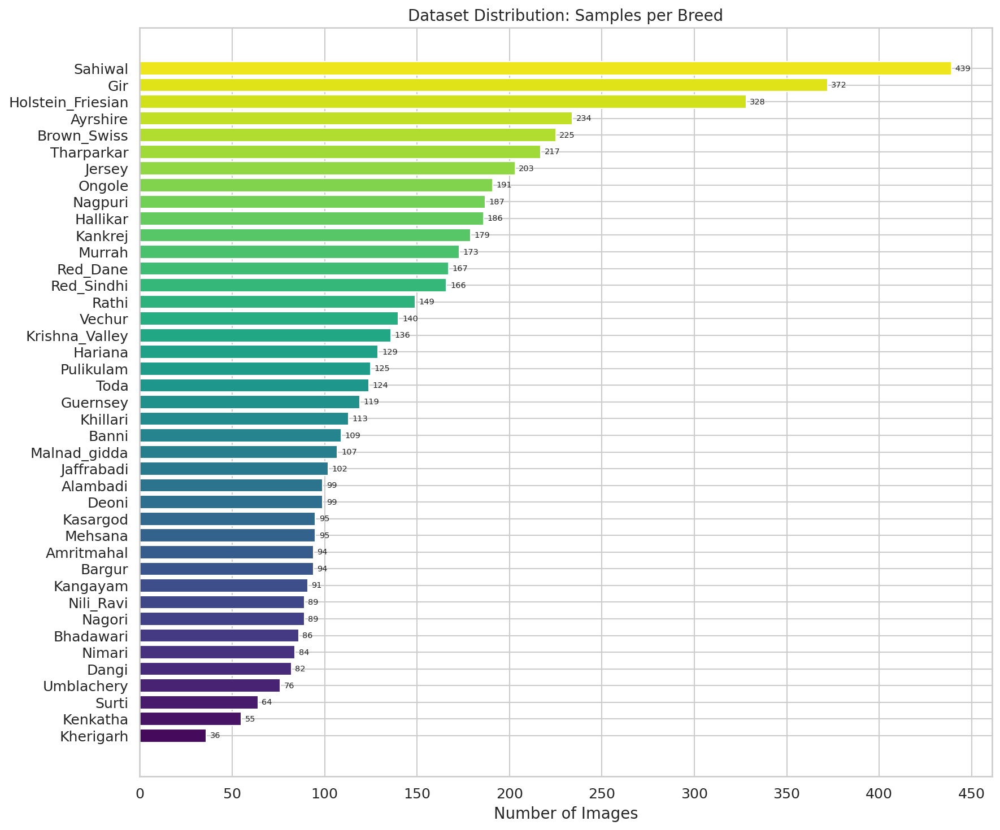

#### Parameter Distribution
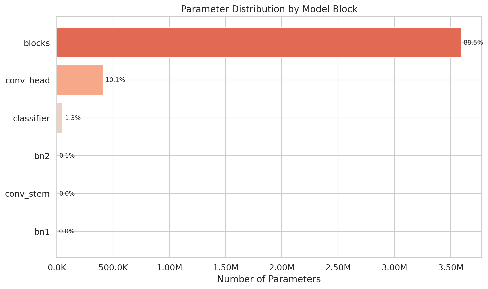

#### Layer Type Distribution
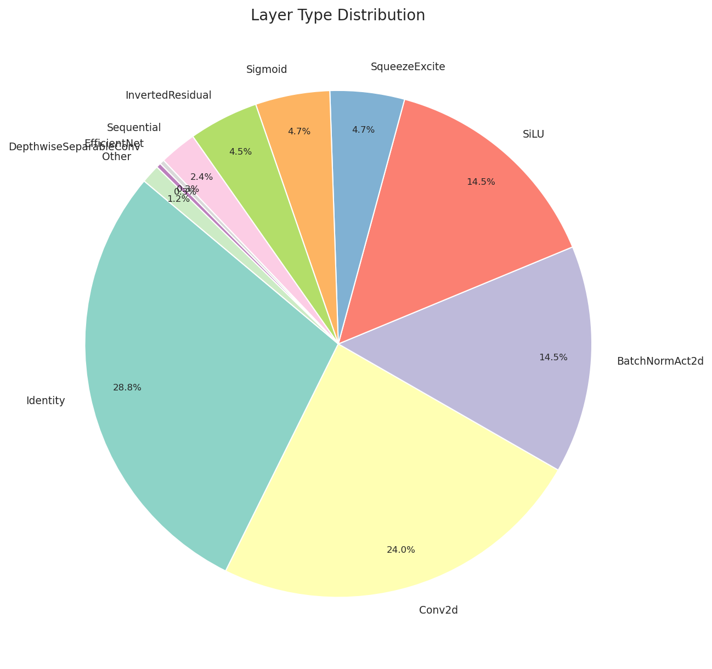

#### Confusion Matrix
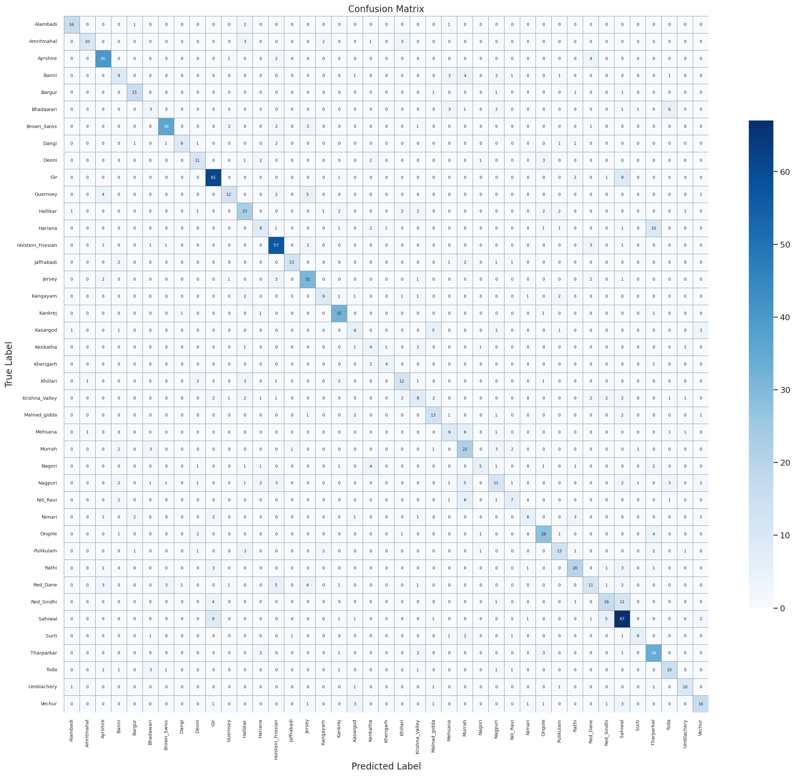

#### Normalised Confusion Matrix
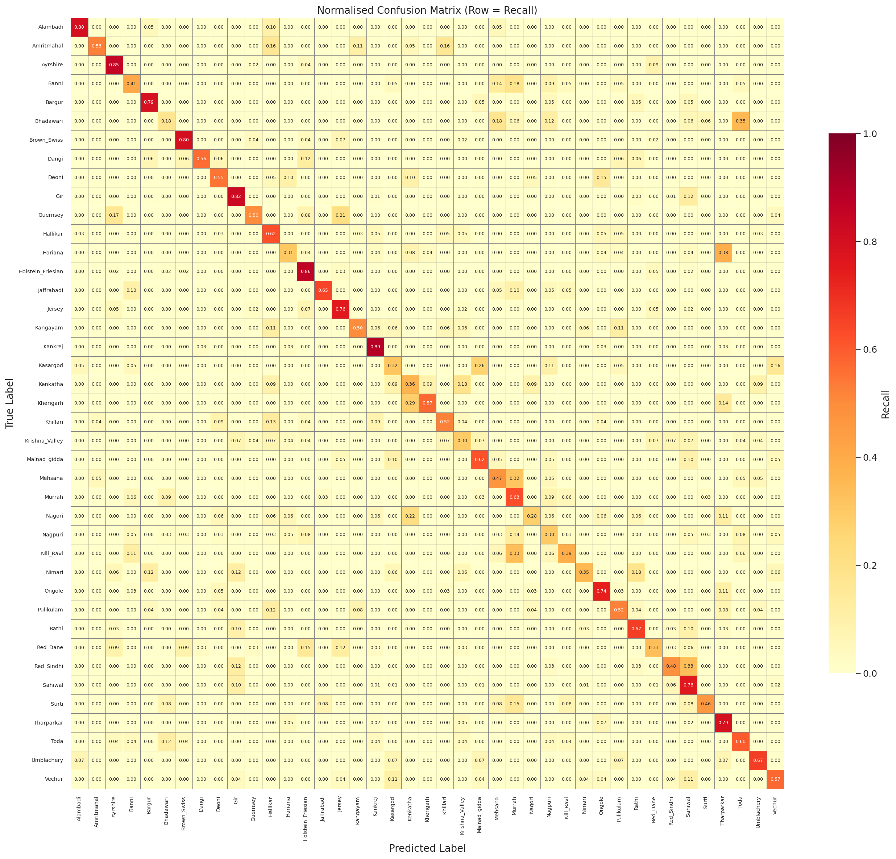

#### Per-Class F1 Score
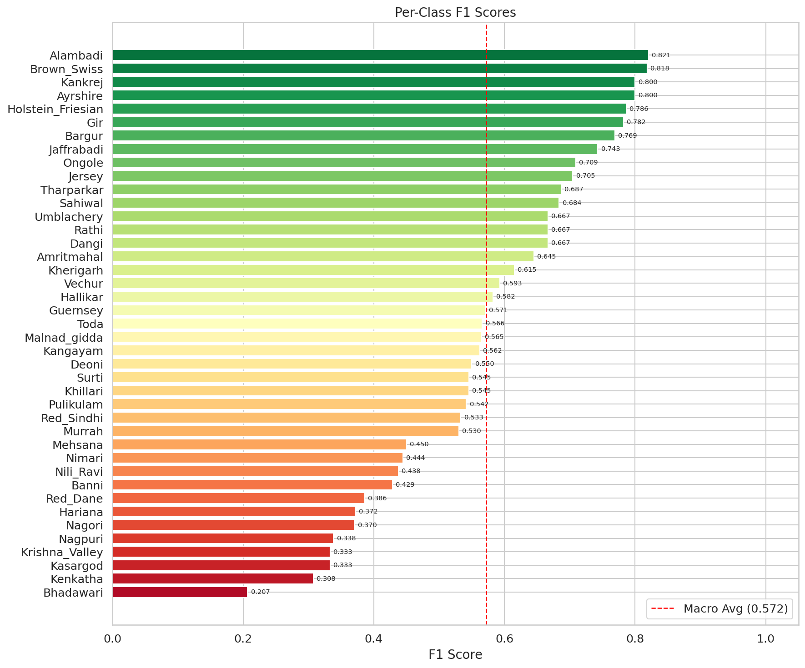

#### Per-Class Precision and Recall
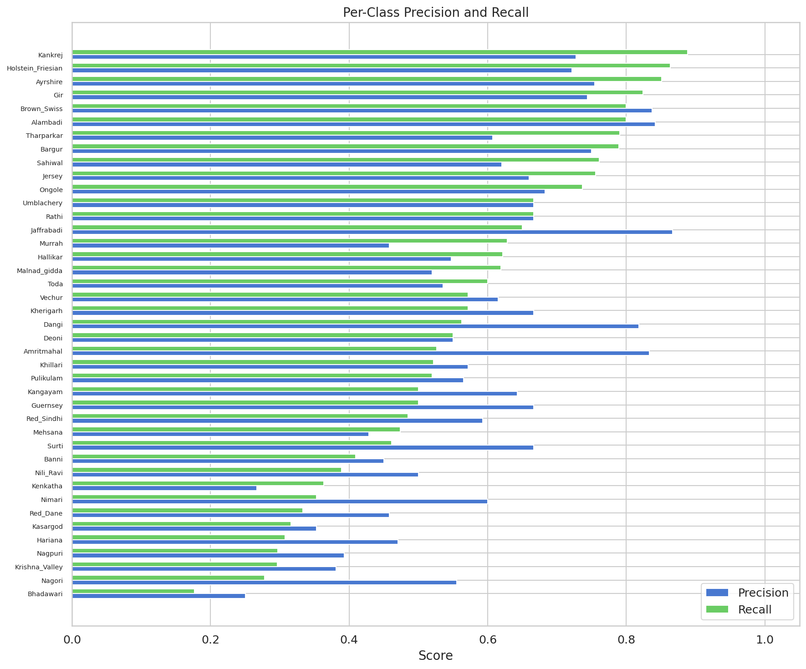

#### Metrics Summary
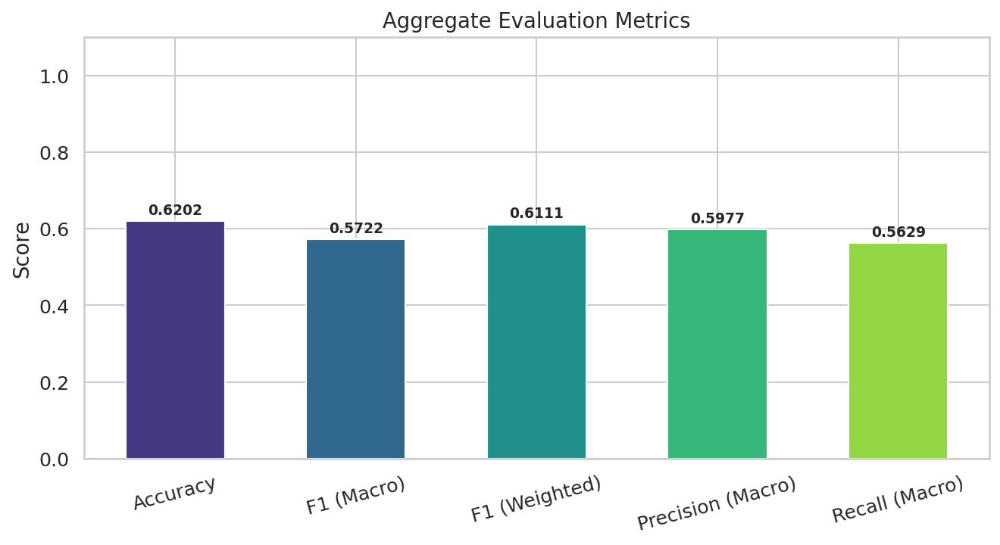

#### Top and Bottom Performing Classes
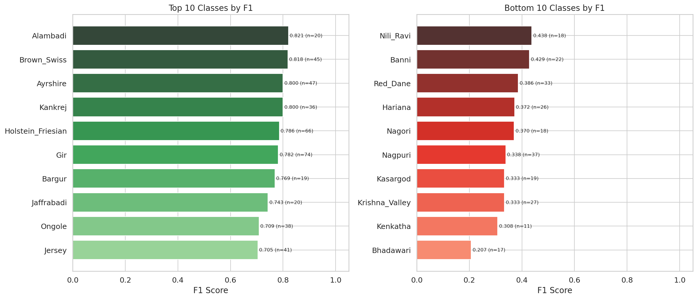

#### Model Size Comparison
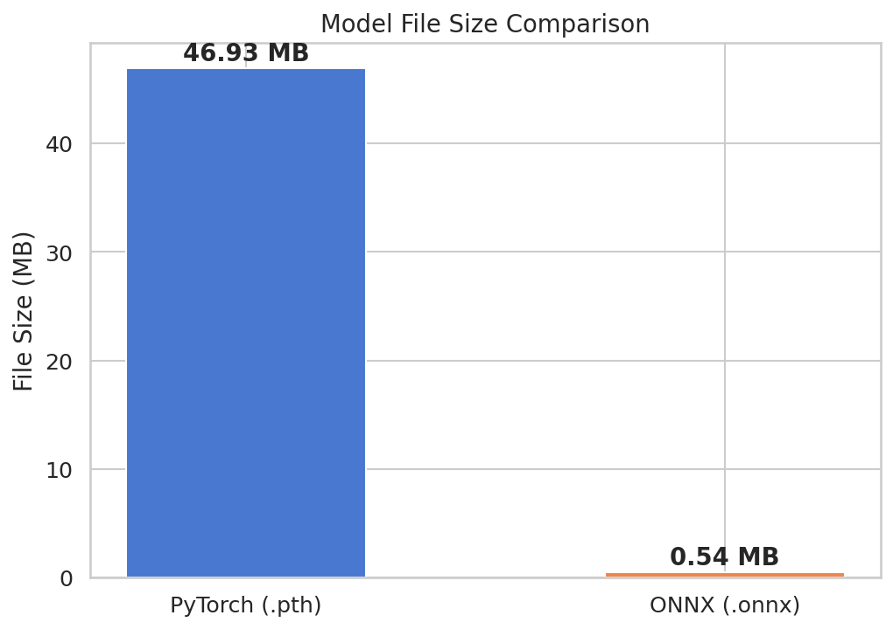

#### Latency Comparison
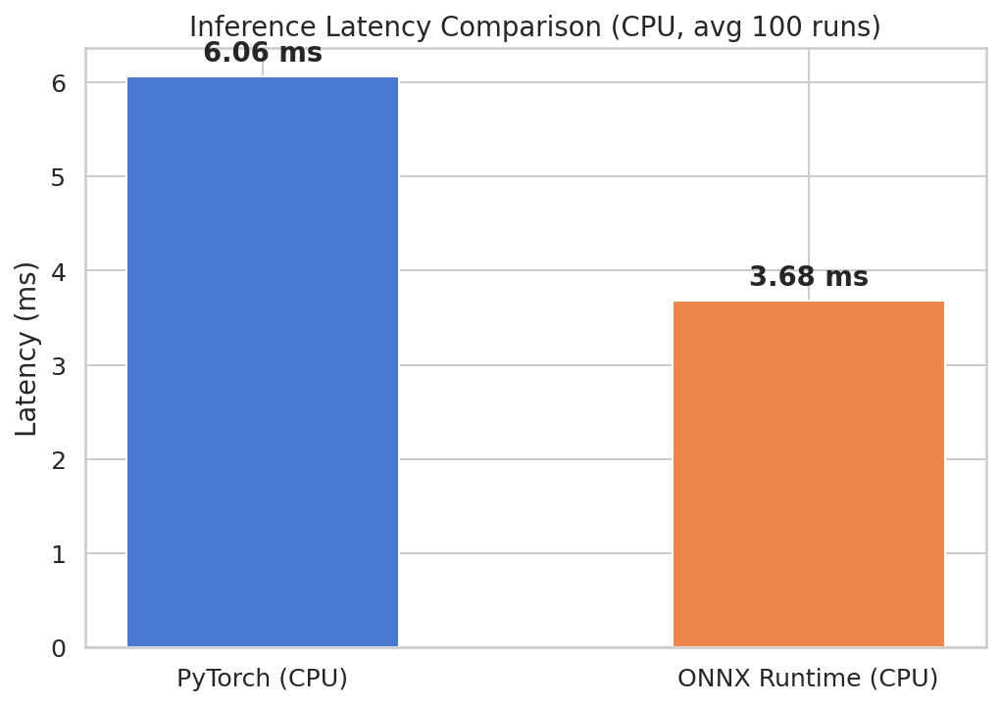

---

## Technical Specifications

| Specification | Detail |
|---|---|
| Architecture | EfficientNet-B0 (timm) |
| Pre-training | ImageNet-1K |
| Input dimensions | 3 x 224 x 224 (RGB, normalised) |
| Output dimensions | 41 (one logit per breed class) |
| Total parameters | ~5.3 million |
| Classification head | Linear(1280, 41) with Dropout(0.4) |
| Loss function | CrossEntropyLoss with label smoothing (epsilon = 0.1) |
| Optimiser | AdamW |
| Training framework | PyTorch |
| Export formats | ONNX (opset 18, dynamic batch), TorchScript Lite (.ptl) |
| Detection model | YOLOv8-nano (Ultralytics, COCO pre-trained) |
| Number of classes | 41 |
| Training samples | ~55,000+ (10x augmentation + 15x for hard-neg breeds) |
| Validation samples | ~1,190 (20% stratified holdout, no augmentation) |
| Test-time augmentation | 8 views (center, hflip, 4 corners, brightness ±10%) |
| Hard-negative pairs | 26 breed pairs with dedicated Phase 3 fine-tuning |
| Overall accuracy | 88.59% (5,251/5,927 images) |

---

## License

This project is licensed under the **MIT License**. See the [LICENSE](LICENSE) file for details.

Copyright (c) 2025 Varun Jhaveri

---

## Acknowledgements

- **EfficientNet**: Tan, M. and Le, Q. V., "EfficientNet: Rethinking Model Scaling for Convolutional Neural Networks," in Proceedings of the 36th International Conference on Machine Learning (ICML), 2019.
- **timm**: Wightman, R., "PyTorch Image Models," GitHub repository, 2019. Available: https://github.com/huggingface/pytorch-image-models
- **Albumentations**: Buslaev, A. et al., "Albumentations: Fast and Flexible Image Augmentations," Information, vol. 11, no. 2, p. 125, 2020.
- **YOLOv8**: Jocher, G. et al., "Ultralytics YOLOv8," 2023. Available: https://github.com/ultralytics/ultralytics
- **Mixup**: Zhang, H. et al., "mixup: Beyond Empirical Risk Minimization," in Proceedings of the International Conference on Learning Representations (ICLR), 2018.
- **CutMix**: Yun, S. et al., "CutMix: Regularization Strategy to Train Strong Classifiers with Localizable Features," in Proceedings of the IEEE/CVF International Conference on Computer Vision (ICCV), 2019.
